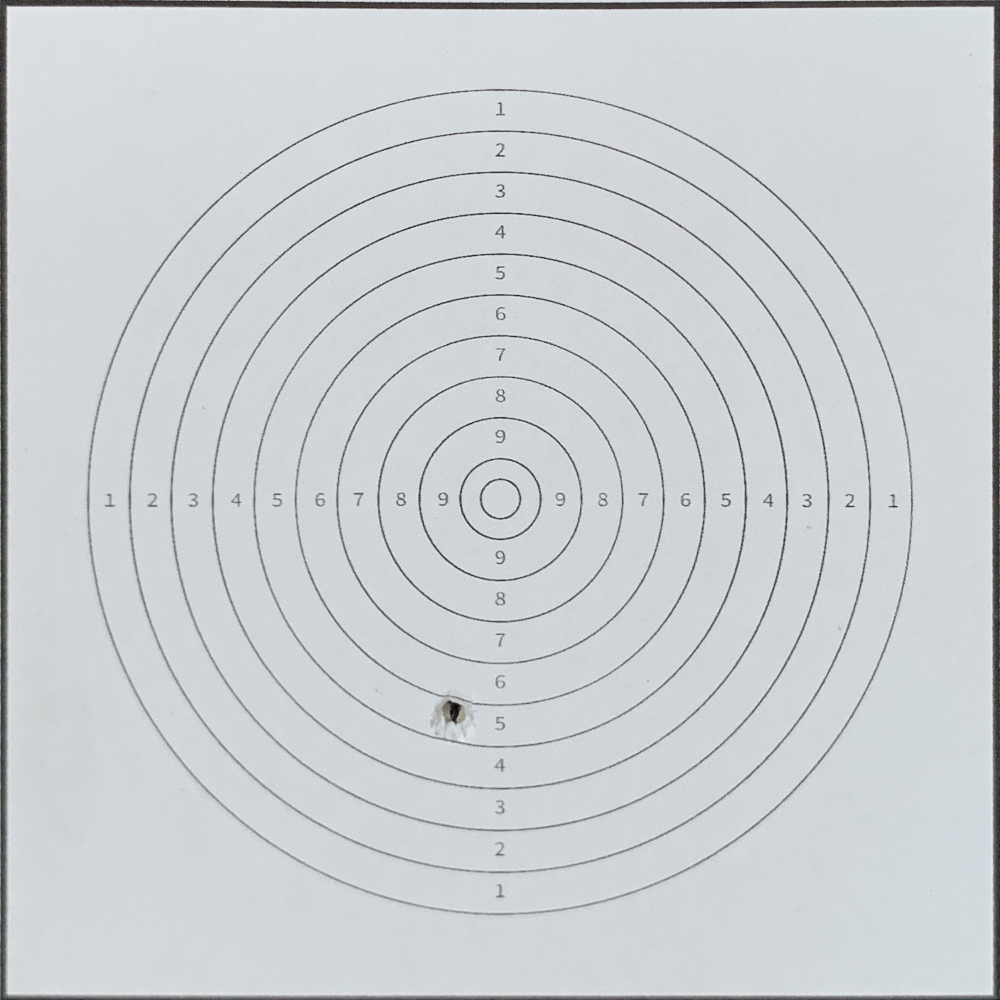

# Target Detecting System

[matches]: output/matches_1.jpg 
[shapes]: output/shapes_1.jpg 
[display]: output/display_1.jpg 
[display2]: output/display_2.jpg 
[center]: output/center_1.jpg 
[board]: test_img_6/aligned_shot_1.JPG


### Requirements
```
numpy                             1.21.4
opencv-python                     4.5.4.60
scikit-image                      0.19.1
matplotlib                        3.5.1
scipy                             1.7.3
sounddevice                       0.4.3
imutils                           0.5.4
```

### Scripts
- `\board_design`: custom target boards that were designed for the detecting system.
- `\targetsys`: virtualenv
- `\test_img_*`: images taken by the camera when the player take a new shot, `shot_0.JPG` is an image with the board that has no shot, `shot_1.JPG` is an image with the board that has 1 shot etc.
- `alignByRefImg.py`: detecting and extract target board by its geometric shape.
- `alignBySquares.py`: detecting and extract target board by ORB (oriented BRIEF) features and interest points.
- `sound.py`: take photo and save it to file when the sound from microphone hit a certain threshold. The threshold was set based on multiple experiments with sounds of rifle and surrounding environment.
- `score.py`: take extracted target board image as an input then detect the shot location and calculat the final score.

### Detecting the target board by geometric shapes
![detecting shapes][shapes]

### Detecting and extracting the target board by SIFT points
![matching reference images][matches]

### Extacted target board
<!-- ![target board][board] -->


### Processing images
![detecting target][center]

### Location of the bullet hole and the final score
Example shot 1:
![score1][display]
Example shot 2:
![score2][display2]

## Testing Scripts
```bash
# detecting the board by geometric shapes
python alignBySquares.py input.jpg output.jpg

# example
python alignBySquares.py test_img_6/shot_1.JPG test_img_6/aligned_shot_1.JPG

# detecting the board by ORB features
python alignByRefImg.py output.jpg input.jpg reference.jpg

# example
python alignByRefImg.py test_img_6/aligned_shot_1.JPG test_img_6/shot_1.JPG test_img_6/aligned_shot_0.jpg

# get final score
python score.py input.jpg

# example
python score.py test_img_6/aligned_shot_1.jpg
```

<!-- ## Improvements
-  -->
