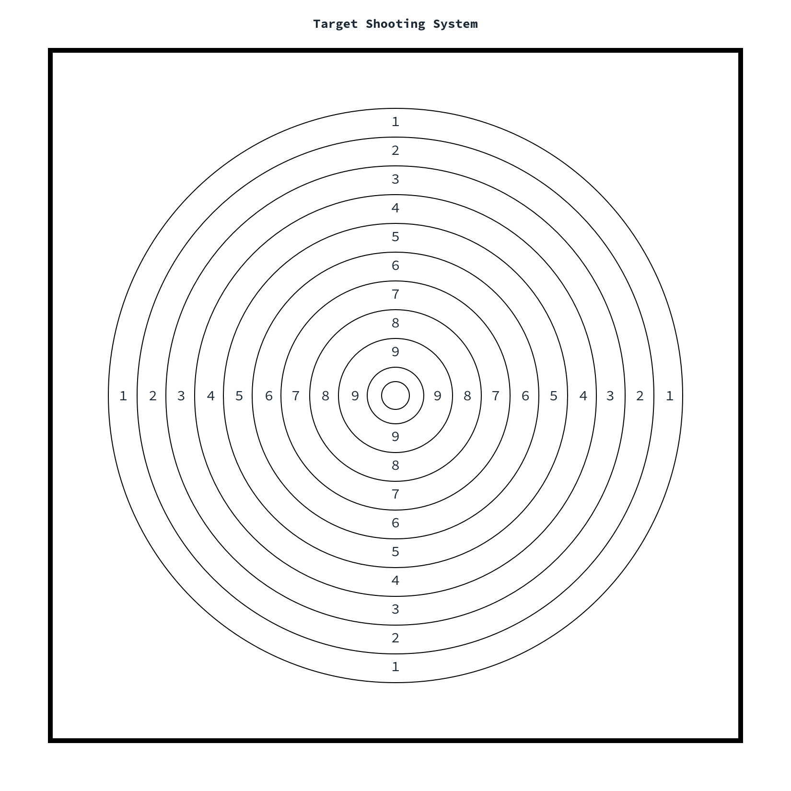

# Target Detecting System

Implementation of the target scoring system in Python, an revised implementation in C++ can be found here: [C++ Implementation](https://github.com/wrayx/target-score-c++/). The project utilise the OpenCV libarary and some python native libraries. Below are the packege requirements output from the pip package manager at the time of developing the project.

[matches]: output/matches_1.jpg 
[shapes]: output/shapes_1.jpg 
[display]: output/display_1.jpg 
[display2]: output/display_2.jpg 
[center]: output/center_1.jpg 
[board_design]: board_design/board_5.png


### Requirements
```
numpy                             1.21.4
opencv-python                     4.5.4.60
scikit-image                      0.19.1
matplotlib                        3.5.1
scipy                             1.7.3
sounddevice                       0.4.3
imutils                           0.5.4
```

### Scripts
- `\board_design`: custom target boards created for the detection system.
- `\targetsys`: virtualenv
- `\test_img_*`: images taken by the camera when the player takes a shot. `shot_0.JPG` is an image with the board that has no shot, `shot_1.JPG` is an image with the board that has 1 shot etc.
- `alignByRefImg.py`: detects and extracts the target board based on its geometric shape.
- `alignBySquares.py`: Detecting and extracting target board features and interest points using ORB (oriented BRIEF).
- `sound.py`: runs continuously to take photos and save them to a folder when the sound from the microphone hits a certain threshold. The threshold was set based on multiple experiments with the sounds of the rifle and the surrounding environment.
- `score.py`: takes an extracted target board image as an input, then detects the shot location and calculates the final score.

### Printed target


### Detecting the target board by geometric shapes
![detecting shapes][shapes]

### Detecting and extracting the target board by ORB features
![matching reference images][matches]

### Processing images
![detecting target][center]

### Location of the bullet hole and the final score
Example shot 1:
![score1][display]
Example shot 2:
![score2][display2]

## Testing Scripts
```bash
# detecting the board by geometric shapes
python alignBySquares.py input.jpg output.jpg

# example
python alignBySquares.py test_img_6/shot_1.JPG test_img_6/aligned_shot_1.JPG

# detecting the board by ORB features
python alignByRefImg.py output.jpg input.jpg reference.jpg

# example
python alignByRefImg.py test_img_6/aligned_shot_1.JPG test_img_6/shot_1.JPG test_img_6/aligned_shot_0.jpg

# get final score
python score.py input.jpg

# example
python score.py test_img_6/aligned_shot_1.jpg
```

## Improvements
- **Lens Distortions** - As seen from the mapping photo, slight distortions were present as the circle in the photo is not perfect. That may not be a problem for other object recognition applications, but in this case, any slight distortion could noticeably affect the final score. 
- **Sound conditions** - no sound filter was present to filter out the environmental sounds, so that the conditions to trigger the photo-taking action could be very sensitive to the surrounding sounds.
- **Other variances** - lightings, occlusions, background clutter were carefully controlled in the current testing environment. Anything drawn on the board with colors could effect the algorithm performances. The detection programme is very sensitive to those variances.
